# Alcatraz
Alcatraz is a x64 binary obfuscator that is able to obfuscate various different pe files including: 
- .exe
- .dll
- .sys

# Overview
- [Alcatraz](#alcatraz)
- [Usage](#usage)
- [Features](#features)
    + [Obfuscation of immediate moves](#obfuscation-of-immediate-moves)
    + [Control flow flattening](#control-flow-flattening)
    + [ADD mutation](#add-mutation)
    + [Entry-point obfuscation](#entry-point-obfuscation)
    + [Lea obfuscation](#lea-obfuscation)
    + [Anti disassembly](#anti-disassembly)
    + [Import obfuscation](#import-obfuscation)
	+ [Final result](#final-result)

# Usage
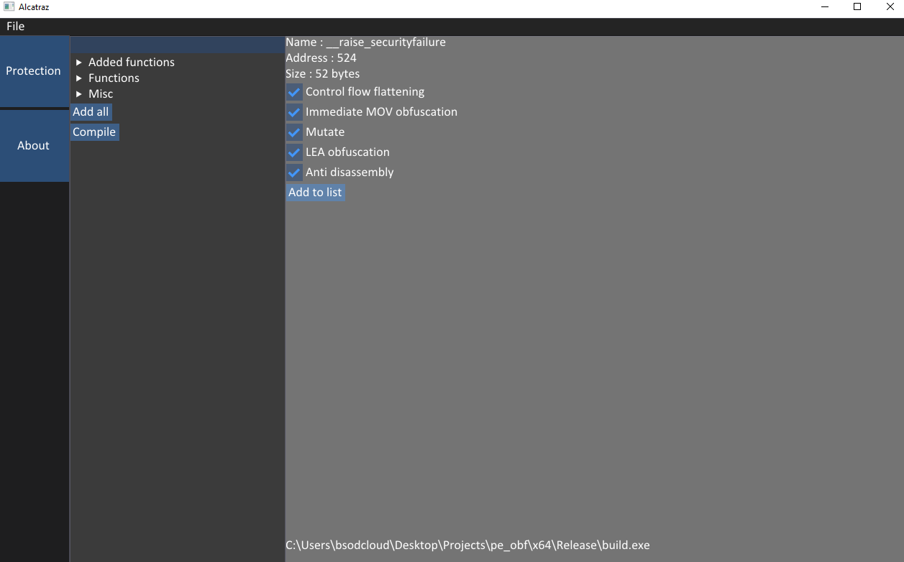
1.) Load a binary by clicking `file` in the top left corner.  
2.) Add functions by expanding the `Functions` tree. (You can search by putting in the name in the searchbar at the top)  
3.) Hit `compile` (note: obfuscating lots of functions might take some seconds)  
# Features
In the following showcase all features (besides the one being showcased) are disabled.
### Obfuscation of immediate moves
If an immediate value is moved into a register, we obfuscate it by applying multiple bitwise operations. Let's take a look at the popular function `_security_init_cookie`.  
Before:
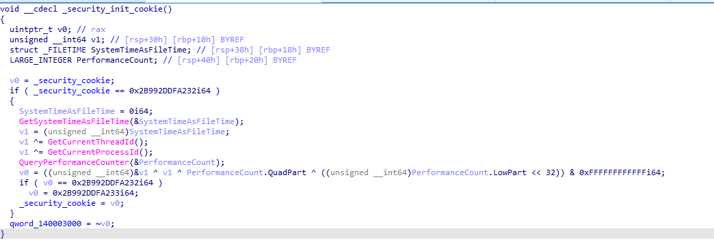
After:
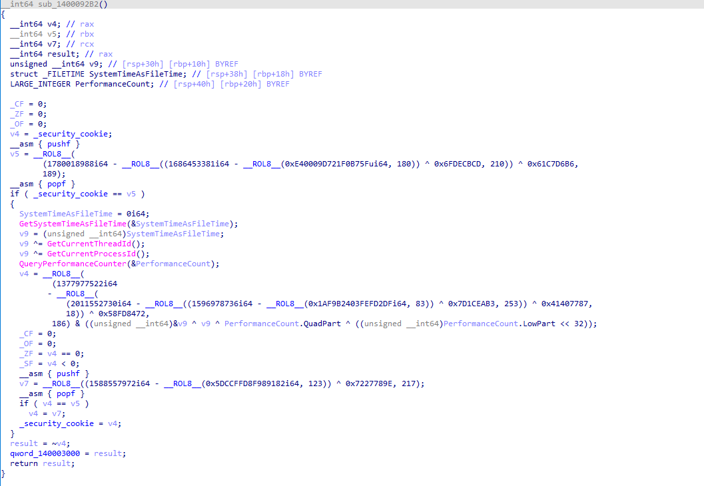
### Control flow flattening
By removing the tidy program structure the compiler generated and putting our code into new generated blocks, we increase the complexity of the program. Lets take this simple function `main` as example (optimization for this program is disabled):  
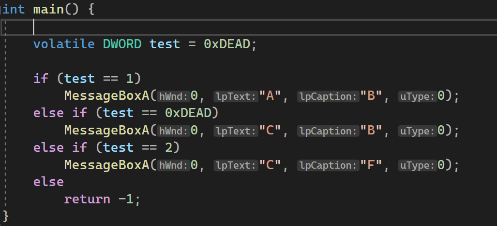  
If we throw this into IDA 7.6 the decompiler will optimize it:  
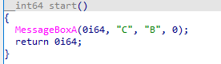  
Now let's flatten its control flow and let IDA analyze it again:  
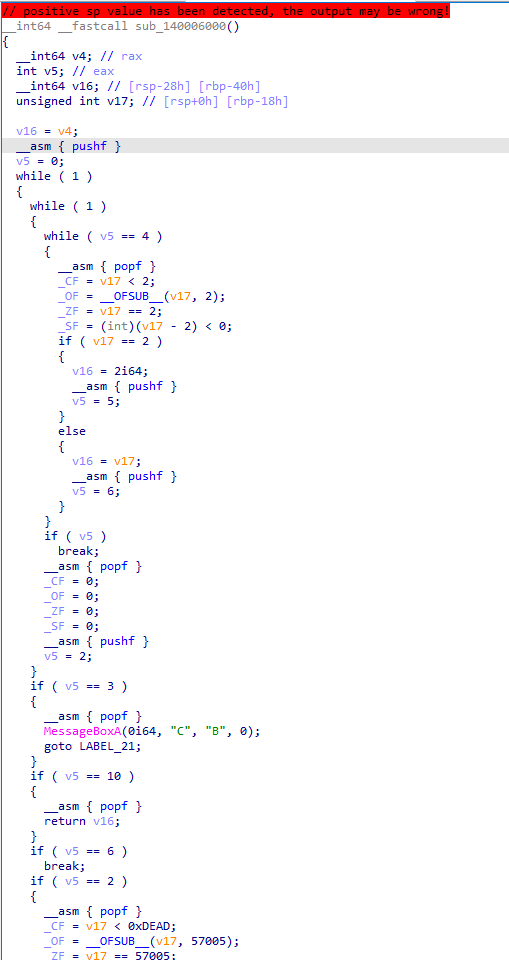  
As you can see, the complexity increased by a lot even though I only show a small portion of the generated code. If you want to know what the cfg looks like:
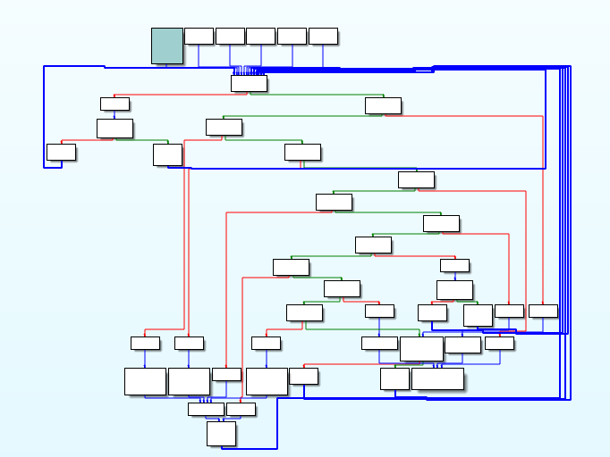  
### ADD mutation
If a register (eg. RAX) is added to another register (eg. RCX) we will mutate the instruction. This means that the syntax changes but not the semantic.
The instruction `ADD RCX, RAX` can be mutated to:  
```asm
push rax
not rax
sub rcx, rax
pop rax
sub rcx, 1
```
If you want to learn more about mutation take a look at [perses](https://github.com/mike1k/perses).
### Entry point obfuscation
If the PE file is a .exe (.dll support will be added) we will create a custom entry point that decrypts the real one on startup (!!! doesn't work when beeing manual mapped).  
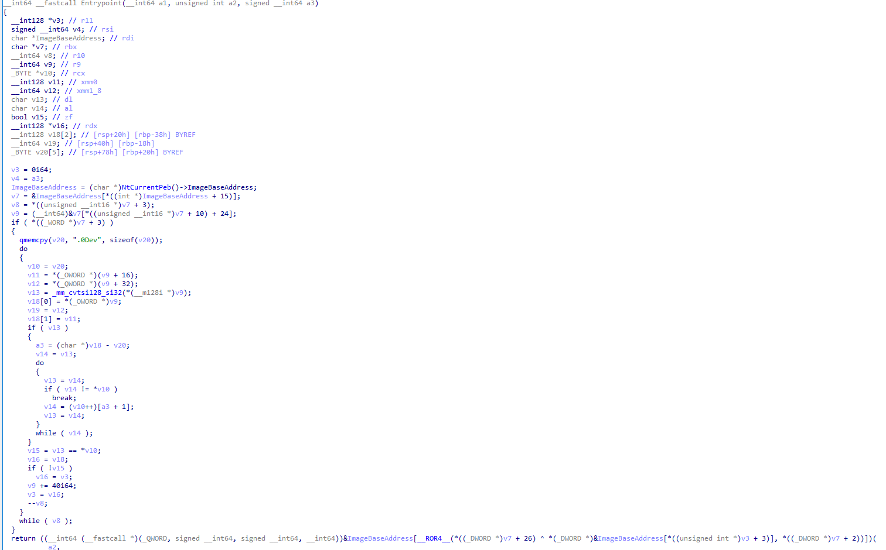  
### Lea obfuscation
The lea obfuscation is quite simple yet effective. We move a different location into the register and decrypt it afterwards. This way, reverse engineers can't cross reference certain data / functions.  
Let's say we find the following instruction: `lea rcx, [0xDEAD]`  
We will mutate it to:
```asm
pushf
lea rcx, [1CE54]
sub rcx, EFA7
popf

rcx -> 0xDEAD
```
### Anti disassembly
If we find an instruction that starts with the byte 0xFF we will put a 0xEB infront of it.  
We do this because 0xEB 0xFF encodes to jmp rip + 1 which, in the end, jumps to our actual first 0xFF. This will throw off tools that decode instructions in a linear way.  
Before:  
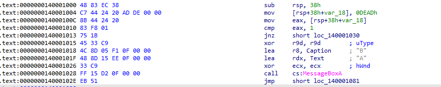  
After:  
  
  
  
From time to time we can insert:  
```asm
jz 3
jne 1
0xE8
```
IDA will try to decode the 0xE8 (call) but won't have any success:  
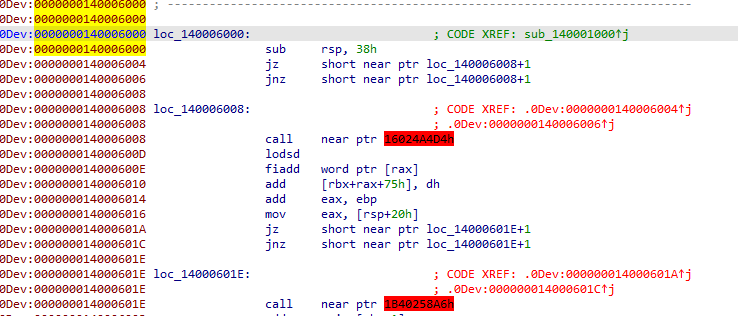  

### Import obfuscation
There is no "proper" IAT obfuscation at the moment. The 0xFF anti disassembly trick takes care of it for now. Proper implementation is planned here:  
[iat.cpp](Alcatraz/obfuscator/misc/iat.cpp)

### Final result
This is a snippet of our `main` function with everything except anti disassembly enabled (so IDA can create a function):  
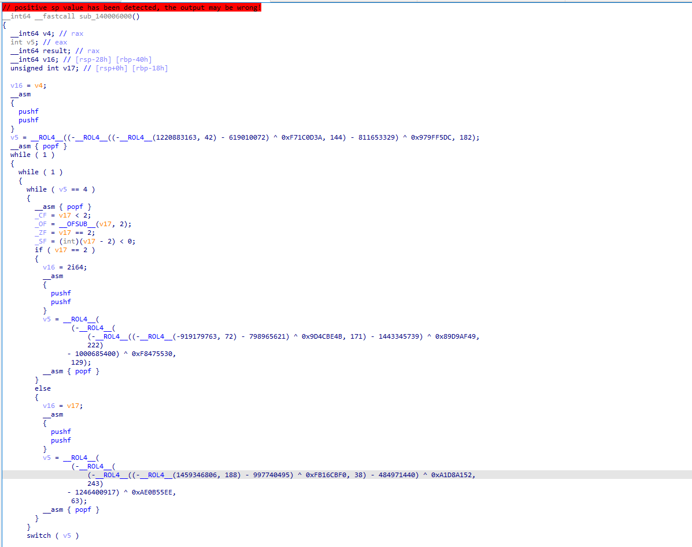  